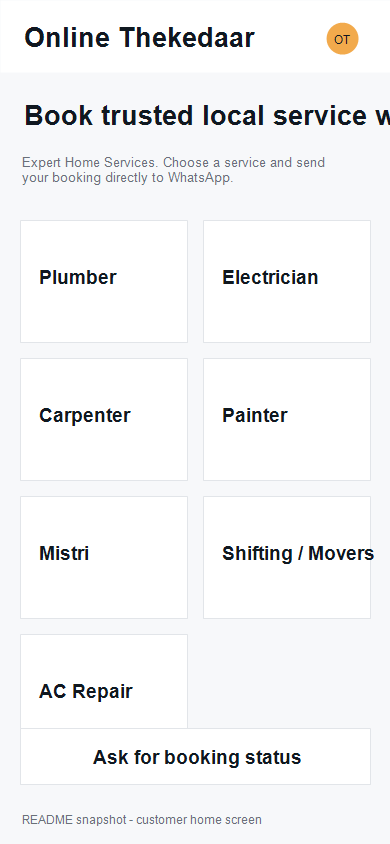

# Online Thekedaar

**Expert Home Services**

Online Thekedaar is a Flutter service-booking app for local home services. Customers choose a service, fill a booking form, and the app opens WhatsApp with a structured booking message addressed to the admin/business number.

## Features

- Splash screen with configurable logo path in `lib/config/app_config.dart`
- Customer-facing service selection screen
- Booking form for name, WhatsApp number, GPS location, manual address, required date/time, and job description
- Tracking number generation in `OT-123456` format
- WhatsApp booking handoff through Android native intent
- Booking status update request screen
- Owner/admin service manager to add, remove, and reset services without editing Dart code
- Owner/admin WhatsApp number setting stored locally on device
- Runtime location permission handling with manual-address fallback

## Default Services

- 🔧 Plumber
- 💡 Electrician
- 🪚 Carpenter
- 🎨 Painter
- 🧱 Mistri
- 🚚 Shifting / Movers
- ❄️ AC Repair

## App Snapshot



The latest APK is generated at:

`build/app/outputs/flutter-apk/app-debug.apk`

Current customer flow:

1. Open app
2. Select a service
3. Fill booking details
4. Fetch GPS location or use manual address only
5. Send the generated booking message to Online Thekedaar on WhatsApp

Admin flow:

1. Open app
2. Tap the admin/settings icon in the top bar
3. Add/remove customer-facing services
4. Change the receiving WhatsApp number

## Secure WhatsApp Number Configuration

The app has a safe default configured through Dart environment variables:

```dart
String.fromEnvironment('OT_WHATSAPP_NUMBER')
```

For local builds, pass your private number without committing it:

```powershell
flutter build apk --debug --dart-define=OT_WHATSAPP_NUMBER=918878976452
```

You can also change the number inside the owner/admin screen after installing the app. Real `.env` files are ignored by Git so private values are not pushed to GitHub. Use `.env.example` only as a template.

## Build

```powershell
flutter pub get
flutter analyze
flutter test
flutter build apk --debug
```

## Android Notes

The app requests location permissions at runtime:

- `ACCESS_FINE_LOCATION`
- `ACCESS_COARSE_LOCATION`

If the user denies permission, booking still works with the manual address field.

The Android manifest includes WhatsApp package queries so the app can safely check/open WhatsApp or WhatsApp Business.
